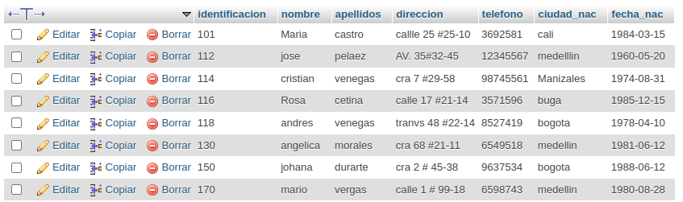
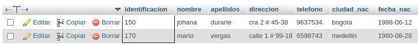
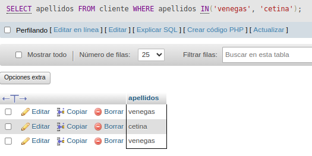
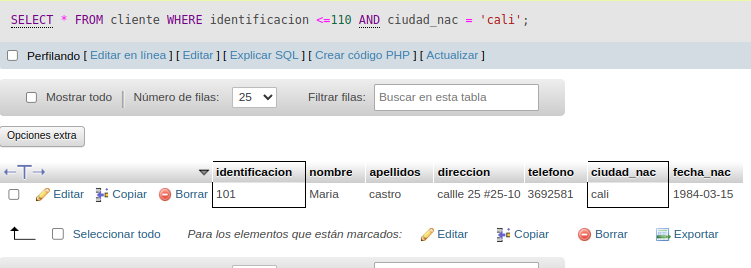
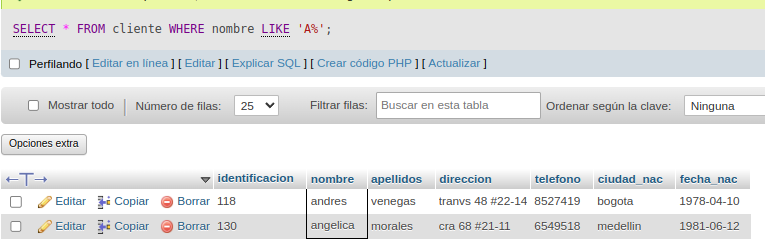
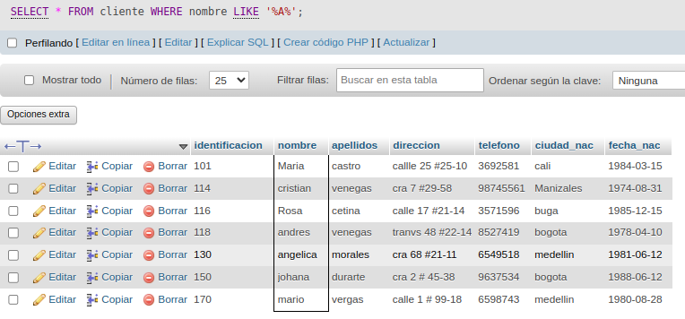
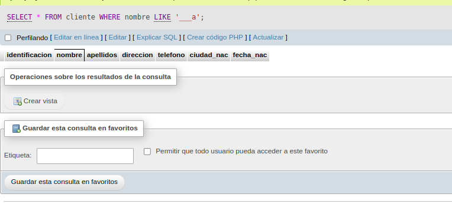
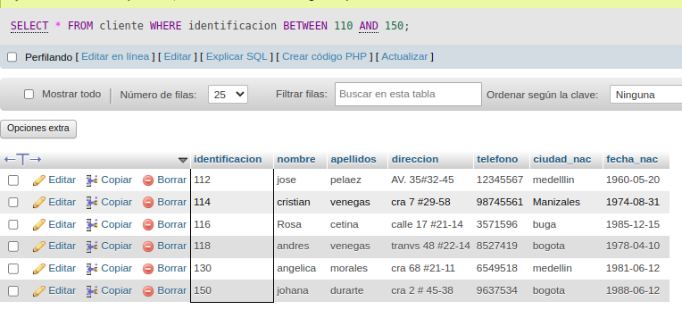
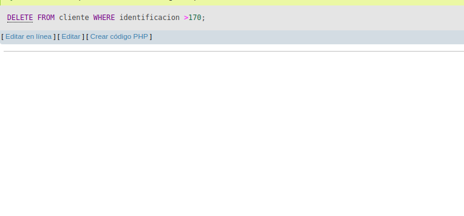
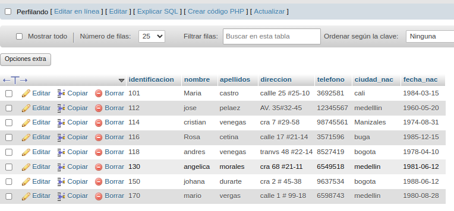

# consultas_1_sql
introducción a las consultas de una base de datos usando el lenguaje SQL

## BASE DE DATOS:VENTAS 
## TABLA: CLIENTE 

## Instruccion SELECT 
- permite seleccionar datos de una tabla.!
` SELECT campos_tabla FROM nombre_tabla`
### consulta NO. 1
1. para visualizar toda la informacion que contiene la tabla ciente se puede incluir con la intruccion SELEC el caracter **\*** o cada uno de los campos de la tabla.

- `SELEC + FROM Cliente`
- `SELEC identificacion, nombre, apellidos, dirrecion, telefono, ciudad_nac, fecha_nac FROM Cliente`

### Consulta No. 2

2. para viasualizar solamente la identificacion del cliente: `SELEC identificacion FROM Cliente`

### consulta No. 3 

3. Si se desea obtenerr los registros cuya identificacion sea mayor o igual a 150, se debe utlizar la clausula `where ` que escifica las conciones que deben reunir los registros que se van a seleccionar `SELEC * FROM cLIENTE WHERE identificacion>=150`

### consulta No. 4

4. se desea obtener los registros cuyos apelllidos sean venegas o certina, se debe utilizar el operador in que especifica los registros que se quieren visualizar de una tabla.

`SELECT apellidos FROM clientes WHERE apellidos IN('venegas', 'cetina')

o se puede utilizar el operador `OR`

`SELECT apellidos FROM clientes WHERE apellidos = .`venega` OR àpellidos = `certina`

### consultas No.5 

5. se desea obtener los registros cuya identificacion sea menor de 110 y la ciudad sea cali, se debe utlizar el operador `AND`

`SELECT * FROM cliente WHERE identificacion<=110 AND ciudad = 'cali'`

### Consulta No. 6

6. Si se desea obtener los registros cuyos nnombres empiencen por la letra 'A', se debe utilizar el opperador `LIKE`que utiliza los patrones `%`(todos) y `_`(caracter).

`SELECT * FROM cliente WHERE nombre LIKE 'A%'`

### Consulta NO. 7
 
7. Se desea obtener los registros cuyo nombre tenga la letra 'a'.

` SELEC * FROM cliente WHERE nombre LIKE '%A%'`

### Consulta NO. 8 

8. se desea tener los registros donde la cuarta letra del nombre cliente sea una 'a'.

`SELECT * FROM cliente WHERE nombre LIKE '___a'`

### Consultas 9 

9. Si sedea obtener los registros cuya identificacion este entre el intervalo 110 y 150, se debe utilzar `BETWEEN, que sirve para especificar un intervalo de valores. 

`SELECT * FROM cliente WHERE identificacion BETWEEN 110 AND 150`

## INstrucción DELETE 
- PERMITE BORRRA TODOS O UN GRUPO ESPECIFICO DE REGISTROS DE UNA TABLA. 
- Su formato es : ` DELETE FROM nombre_tabla`

### Eliminacion NO. 1 

1. Eliminar los registros cuya identificacion sea mayor a 170.

`DELETE FROM cliente WHERE identifiaccion >170 ` 

